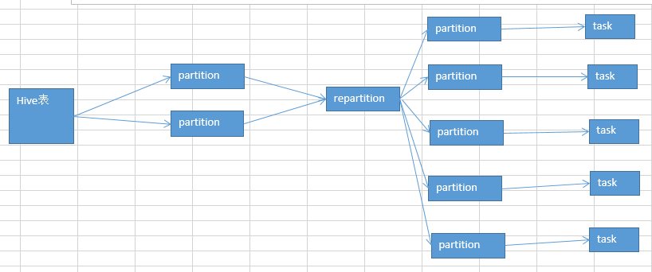

# 17.算子调优之使用repartition解决Spark SQL低并行度的性能问题

#### 并行度：

1、spark.default.parallelism
2、textFile()，传入第二个参数，指定partition数量（比较少用）

项目代码中，没有设置并行度，实际上，在生产环境中，是最好自己设置一下的。官网有推荐的设置方式，你的spark-submit脚本中，会指定你的application总共要启动多少个executor，100个；每个executor多少个cpu core，2~3个；总共application，有cpu core，200个。

官方推荐，根据application的总cpu core数量（在spark-submit中可以指定，200个），自己手动设置spark.default.parallelism参数，指定为cpu core总数的2~3倍。400~600个并行度。600。

#### 你设置的这个并行度，在哪些情况下会生效？哪些情况下，不会生效？
如果你压根儿没有使用Spark SQL（DataFrame），那么你整个spark application默认所有stage的并行度都是你设置的那个参数。（除非你使用coalesce算子缩减过partition数量）

问题来了，Spark SQL，用了。用Spark SQL的那个stage的并行度，你没法自己指定。Spark SQL自己会默认根据hive表对应的hdfs文件的block，自动设置Spark SQL查询所在的那个stage的并行度。你自己通过spark.default.parallelism参数指定的并行度，只会在没有Spark SQL的stage中生效。

比如你第一个stage，用了Spark SQL从hive表中查询出了一些数据，然后做了一些transformation操作，接着做了一个shuffle操作（groupByKey）；下一个stage，在shuffle操作之后，做了一些transformation操作。hive表，对应了一个hdfs文件，有20个block；你自己设置了spark.default.parallelism参数为100。

你的第一个stage的并行度，是不受你的控制的，就只有20个task；第二个stage，才会变成你自己设置的那个并行度，100。

##### 问题在哪里？

Spark SQL默认情况下，它的那个并行度，咱们没法设置。可能导致的问题，也许没什么问题，也许很有问题。Spark SQL所在的那个stage中，后面的那些transformation操作，可能会有非常复杂的业务逻辑，甚至说复杂的算法。如果你的Spark SQL默认把task数量设置的很少，20个，然后每个task要处理为数不少的数据量，然后还要执行特别复杂的算法。

这个时候，就会导致第一个stage的速度，特别慢。第二个stage，1000个task，刷刷刷，非常快。

#### 解决上述Spark SQL无法设置并行度和task数量的办法，是什么呢？

repartition算子，你用Spark SQL这一步的并行度和task数量，肯定是没有办法去改变了。但是呢，可以将你用Spark SQL查询出来的RDD，使用repartition算子，去重新进行分区，此时可以分区成多个partition，比如从20个partition，分区成100个。

然后呢，从repartition以后的RDD，再往后，并行度和task数量，就会按照你预期的来了。就可以避免跟Spark SQL绑定在一个stage中的算子，只能使用少量的task去处理大量数据以及复杂的算法逻辑。

示意图：

