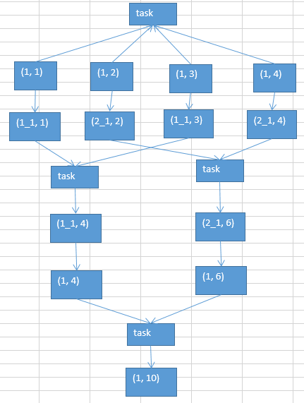

# 30.数据倾斜解决方案之使用随机key实现双重聚合

使用随机key实现双重聚合

1. 原理

2. 使用场，,比较适合使用这种方式
   （1）groupByKey
   （2）reduceByKey

> join，通常不会这样来做，后面会讲三种，针对不同的join造成的数据倾斜的问题的解决方案。

第一轮聚合：先将key前面添加上随机数，如0-9，进行打散，然后进行局部聚合（问题：当如果key很分散，其实局部聚合基本没什么效果，但问题是，既然很分散就不会数据倾斜了！）

然后，再对key的前缀去除，进行全局聚合。

对groupByKey、reduceByKey造成的数据倾斜，有比较好的效果。  

如果说，前的第一、第二、第三种方案，都没法解决数据倾斜的问题，那么就只能依靠这一种方式了。