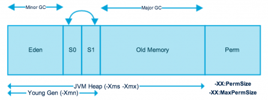

# 8.JVM调优之原理概述以及降低cache操作的内存占比

#### 直接使用：
```java
// 表示60%内存留给cache、persist，40%留给程序运行时对象存放使用
// 根据实际程序是否需要那么多cache来设置。
spark.storage.memoryFraction=0.6
```
##### 调优背景整体说明：

1、常规性能调优：分配资源、并行度。。。等

2、JVM调优（Java虚拟机）：JVM相关的参数，通常情况下，如果你的硬件配置、基础的JVM的配置，都ok的话，JVM通常不会造成太严重的性能问题；反而更多的是，在troubleshooting中，JVM占了很重要的地位；JVM造成线上的spark作业的运行报错，甚至失败（比如OOM）。

3、shuffle调优（相当重要）：spark在执行groupByKey、reduceByKey等操作时的，shuffle环节的调优。这个很重要。shuffle调优，其实对spark作业的性能的影响，是相当之高！！！经验：在spark作业的运行过程中，只要一牵扯到有shuffle的操作，基本上shuffle操作的性能消耗，要占到整个spark作业的50%~90%。10%用来运行map等操作，90%耗费在两个shuffle操作。groupByKey、countByKey。

4、spark操作调优（spark算子调优，比较重要）：groupByKey，countByKey或aggregateByKey来重构实现。有些算子的性能，是比其他一些算子的性能要高的。foreachPartition替代foreach。如果一旦遇到合适的情况，效果还是不错的。

##### 一般效果排序：
1、分配资源、并行度、RDD架构与缓存
2、shuffle调优
3、spark算子调优
4、JVM调优、广播大变量。。。

####  内存调优说明



每一次放对象的时候，都是放入eden区域，和其中一个survivor区域；另外一个survivor区域是空闲的。

当eden区域和一个survivor区域放满了以后（spark运行过程中，产生的对象实在太多了），就会触发minor gc，小型垃圾回收。把不再使用的对象，从内存中清空，给后面新创建的对象腾出来点儿地方。

清理掉了不再使用的对象之后，那么也会将存活下来的对象（还要继续使用的），放入之前空闲的那一个survivor区域中。这里可能会出现一个问题。默认eden、survior1和survivor2的内存占比是8:1:1。问题是，如果存活下来的对象是1.5，一个survivor区域放不下。此时就可能通过JVM的担保机制（不同JVM版本可能对应的行为），将多余的对象，直接放入老年代了。

如果你的JVM内存不够大的话，可能导致频繁的年轻代内存满溢，频繁的进行minor gc。频繁的minor gc会导致短时间内，有些存活的对象，多次垃圾回收都没有回收掉。会导致这种短声明周期（其实不一定是要长期使用的）对象，年龄过大，垃圾回收次数太多还没有回收到，跑到老年代。

老年代中，可能会因为内存不足，囤积一大堆，短生命周期的，本来应该在年轻代中的，可能马上就要被回收掉的对象。此时，可能导致老年代频繁满溢。频繁进行full gc（全局/全面垃圾回收）。full gc就会去回收老年代中的对象。full gc由于这个算法的设计，是针对的是，老年代中的对象数量很少，满溢进行full gc的频率应该很少，因此采取了不太复杂，但是耗费性能和时间的垃圾回收算法。full gc很慢。

full gc / minor gc，无论是快，还是慢，都会导致jvm的工作线程停止工作，stop the world。简而言之，就是说，gc的时候，spark停止工作了。等着垃圾回收结束。

内存不充足的时候，问题：
1、频繁minor gc，也会导致频繁spark停止工作
2、老年代囤积大量活跃对象（短生命周期的对象），导致频繁full gc，full gc时间很长，短则数十秒，长则数分钟，甚至数小时。可能导致spark长时间停止工作。
3、严重影响咱们的spark的性能和运行的速度。

####  内存调优方法
JVM调优的第一个点：降低cache操作的内存占比

spark中，堆内存又被划分成了两块儿，一块儿是专门用来给RDD的cache、persist操作进行RDD数据缓存用的；另外一块儿，就是我们刚才所说的，用来给spark算子函数的运行使用的，存放函数中自己创建的对象。

默认情况下，给RDD cache操作的内存占比，是0.6，60%的内存都给了cache操作了。但是问题是，如果某些情况下，cache不是那么的紧张，问题在于task算子函数中创建的对象过多，然后内存又不太大，导致了频繁的minor gc，甚至频繁full gc，导致spark频繁的停止工作。性能影响会很大。

针对上述这种情况，大家可以在之前我们讲过的那个spark ui。yarn去运行的话，那么就通过yarn的界面，去查看你的spark作业的运行统计，很简单，大家一层一层点击进去就好。可以看到每个stage的运行情况，包括每个task的运行时间、gc时间等等。如果发现gc太频繁，时间太长。此时就可以适当调价这个比例。

降低cache操作的内存占比，大不了用persist操作，选择将一部分缓存的RDD数据写入磁盘，或者序列化方式，配合Kryo序列化类，减少RDD缓存的内存占用；降低cache操作内存占比；对应的，算子函数的内存占比就提升了。这个时候，可能，就可以减少minor gc的频率，同时减少full gc的频率。对性能的提升是有一定的帮助的。

一句话，让task执行算子函数时，有更多的内存可以使用。

spark.storage.memoryFraction，0.6 -> 0.5 -> 0.4 -> 0.2

参考：

[spark内存管理详解](https://www.cnblogs.com/wzj4858/p/8204282.html#top)