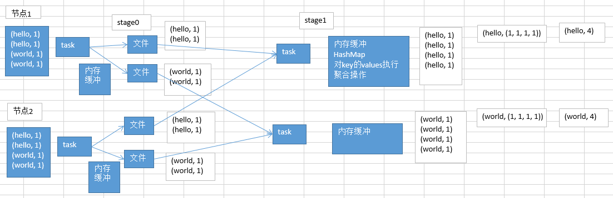

# 10.Shuffle调优之原理概述

#### 什么样的情况下，会发生shuffle？

在spark中，主要是以下几个算子：groupByKey、reduceByKey、countByKey、join，等等。

什么是shuffle？

比如groupByKey，要把分布在集群各个节点上的数据中的同一个key，对应的values，都给集中到一块儿，集中到集群中同一个节点上，更严密一点说，就是集中到一个节点的一个executor的一个task中。

然后呢，集中一个key对应的values之后，才能交给我们来进行处理，<key, Iterable<value>>；reduceByKey，算子函数去对values集合进行reduce操作，最后变成一个value；countByKey，需要在一个task中，获取到一个key对应的所有的value，然后进行计数，统计总共有多少个value；join，RDD<key, value>，RDD<key, value>，只要是两个RDD中，key相同对应的2个value，都能到一个节点的executor的task中，给我们进行处理。

图以reduceByKey(_+_)为例.

问题在于，同一个单词，比如说（hello, 1），可能散落在不同的节点上；对每个单词进行累加计数，就必须让所有单词都跑到同一个节点的一个task中，给一个task来进行处理。

总结：
1. 每一个shuffle的前半部分stage的task，每个task都会创建下一个stage的task数量相同的文件，比如下一个stage会有100个task，那么当前stage每个task都会创建100份文件；会将同一个key对应的values，一定是写入同一个文件中的；不同节点上的task，也一定会将同一个key对应的values，写入下一个stage，同一个task对应的文件中。

   shuffle的后半部分stage的task，每个task都会从各个节点上的task写的属于自己的那一份文件中，拉取key, value对；然后task会有一个内存缓冲区，然后会用HashMap，进行key, values的汇聚；(key ,values)；

   task会用我们自己定义的聚合函数，比如reduceByKey(_+_)，把所有values进行一对一的累加；聚合出来最终的值。就完成了shuffle。

2. shuffle，一定是分为两个stage来完成的。

   因为这其实是个逆向的过程，不是stage决定shuffle，是shuffle决定stage。

   比如：reduceByKey(_+_)，在某个action触发job的时候，DAGScheduler，会负责划分job为多个stage。划分的依据，就是，如果发现有会触发shuffle操作的算子，比如reduceByKey，就将这个操作的前半部分，以及之前所有的RDD和transformation操作，划分为一个stage；shuffle操作的后半部分，以及后面的，直到action为止的RDD和transformation操作，划分为另外一个stage。

3. shuffle前半部分的task在写入数据到磁盘文件之前，都会先写入一个一个的内存缓冲，内存缓冲满溢之后，再spill溢写到磁盘文件中。