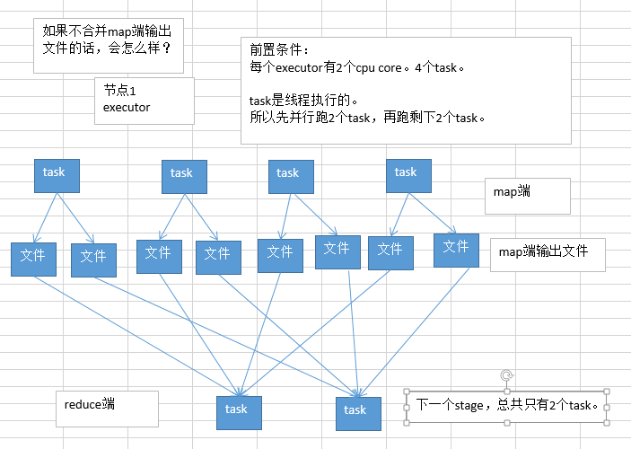
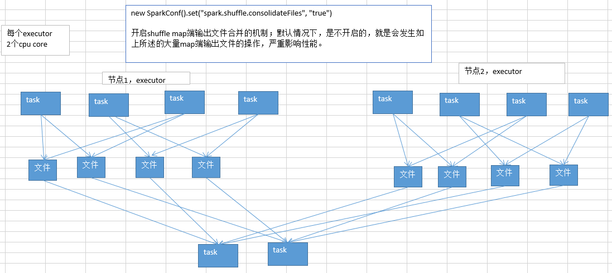

# 11.Shuffle调优之合并map端输出文件

####说明：
Spark 0.8.1 为Hash Based Shuffle引入File Consolidation机制
默认：spark.shuffle.consolidateFile=false
在1.6版本，该参数被取消。

### 说明
1.6之前：

不合并map端输出文件，那么一个task对应生产文件个数等于reduce个数。

> 实际生产环境的条件：
> 100个节点（每个节点一个executor）：100个executor
> 每个executor：2个cpu core
> 总共1000个task：每个executor平均10个task
> 每个节点，10个task，每个节点会输出多少份map端文件？10 * 1000=1万个文件
> 总共多少份map端输出文件？100 * 10000 = 100万。

**开启了map端输出文件的合并机制之后：**

第一个stage，同时就运行cpu core个task，比如cpu core是2个，并行运行2个task；每个task都创建下一个stage的task数量个文件；

第一个stage，并行运行的2个task执行完以后；就会执行另外两个task；另外2个task不会再重新创建输出文件；而是复用之前的task创建的map端输出文件，将数据写入上一批task的输出文件中。

第二个stage，task在拉取数据的时候，就不会去拉取上一个stage每一个task为自己创建的那份输出文件了；而是拉取少量的输出文件，每个输出文件中，可能包含了多个task给自己的map端输出。

**提醒一下（map端输出文件合并）：**

只有并行执行的task会去创建新的输出文件；下一批并行执行的task，就会去复用之前已有的输出文件；但是有一个例外，比如2个task并行在执行，但是此时又启动要执行2个task；那么这个时候的话，就无法去复用刚才的2个task创建的输出文件了；而是还是只能去创建新的输出文件。

要实现输出文件的合并的效果，必须是一批task先执行，然后下一批task再执行，才能复用之前的输出文件；负责多批task同时起来执行，还是做不到复用的。

开启了map端输出文件合并机制之后，生产环境上的例子，会有什么样的变化？

>  实际生产环境的条件：
>  100个节点（每个节点一个executor）：100个executor
>  每个executor：2个cpu core
>  总共1000个task：每个executor平均10个task
>  每个节点，2个cpu core，有多少份输出文件呢？2 * 1000 = 2000个
>
>  总共100个节点，总共创建多少份输出文件呢？100 * 2000 = 20万个文件
>
>  相比较开启合并机制之前的情况，100万个，map端输出文件，在生产环境中，立减5倍！

### 合并map端输出文件，对咱们的spark的性能有哪些方面的影响呢？

1. map task写入磁盘文件的IO，减少：100万文件 -> 20万文件
2. 第二个stage，原本要拉取第一个stage的task数量份文件，1000个task，第二个stage的每个task，都要拉取1000份文件，走网络传输；合并以后，100个节点，每个节点2个cpu core，第二个stage的每个task，主要拉取100 * 2 = 200个文件即可；网络传输的性能消耗是不是也大大减少

分享一下，实际在生产环境中，使用了spark.shuffle.consolidateFiles机制以后，实际的性能调优的效果：对于上述的这种生产环境的配置，性能的提升，还是相当的客观的。spark作业，5个小时 -> 2~3个小时。

大家不要小看这个map端输出文件合并机制。实际上，在数据量比较大，你自己本身做了前面的性能调优，executor上去->cpu core上去->并行度（task数量）上去，shuffle没调优，shuffle就很糟糕了；大量的map端输出文件的产生。对性能有比较恶劣的影响。

这个时候，去开启这个机制，可以很有效的提升性能。

### Spark Shuffle具体实现的演进

在具体的实现上，Shuffle经历了Hash、Sort、Tungsten-Sort三阶段：
1. Spark 0.8及以前 Hash Based Shuffle
    在Shuffle Write过程按照Hash的方式重组Partition的数据，不进行排序。每个map端的任务为每个reduce端的Task生成一个文件，通常会产生大量的文件（即对应为M*R个中间文件，其中M表示map端的Task个数，R表示reduce端的Task个数），伴随大量的随机磁盘IO操作与大量的内存开销。
    Shuffle Read过程如果有combiner操作，那么它会把拉到的数据保存在一个Spark封装的哈希表（AppendOnlyMap）中进行合并。
    在代码结构上：

  - org.apache.spark.storage.ShuffleBlockManager负责Shuffle Write

  - org.apache.spark.BlockStoreShuffleFetcher负责Shuffle Read
  - org.apache.spark.Aggregator负责combine，依赖于AppendOnlyMap

2. Spark 0.8.1 为Hash Based Shuffle引入File Consolidation机制
    通过文件合并，中间文件的生成方式修改为每个执行单位（一个Executor中的执行单位等于Core的个数除以每个Task所需的Core数）为每个reduce端的任务生成一个文件。最终可以将文件个数从M*R修改为E*C/T*R，其中，E表示Executor的个数，C表示每个Executor中可用Core的个数，T表示Task所分配的Core的个数。
    是否采用Consolidate机制，需要配置spark.shuffle.consolidateFiles参数**(1.6之后，取消该参数)**

3. Spark 0.9 引入ExternalAppendOnlyMap
    在combine的时候，可以将数据spill到磁盘，然后通过堆排序merge（可以参考这篇文章，了解其具体实现）

4. Spark 1.1 引入Sort Based Shuffle，但默认仍为Hash Based Shuffle
     在Sort Based Shuffle的Shuffle Write阶段，map端的任务会按照Partition id以及key对记录进行排序。同时将全部结果写到一个数据文件中，同时生成一个索引文件，reduce端的Task可以通过该索引文件获取相关的数据。
     在代码结构上：
     - 从以前的ShuffleBlockManager中分离出ShuffleManager来专门管理Shuffle Writer和Shuffle Reader。两种Shuffle方式分别对应
       - org.apache.spark.shuffle.hash.HashShuffleManager和

       - org.apache.spark.shuffle.sort.SortShuffleManager，

         可通过spark.shuffle.manager参数配置。两种Shuffle方式有各自的ShuffleWriter：org.apache.spark.shuffle.hash.HashShuffle和org.apache.spark.shuffle.sort.SortShuffleWriter；但共用一个ShuffleReader，即org.apache.spark.shuffle.hash.HashShuffleReader。
     - org.apache.spark.util.collection.ExternalSorter实现排序功能。可通过对spark.shuffle.spill参数配置，决定是否可以在排序时将临时数据Spill到磁盘。

5. Spark 1.2 默认的Shuffle方式改为Sort Based Shuffle

6. Spark 1.4 引入Tungsten-Sort Based Shuffle
    将数据记录用序列化的二进制方式存储，把排序转化成指针数组的排序，引入堆外内存空间和新的内存管理模型，这些技术决定了使用Tungsten-Sort要符合一些严格的限制，比如Shuffle dependency不能带有aggregation、输出不能排序等。由于堆外内存的管理基于JDK Sun Unsafe API，故Tungsten-Sort Based Shuffle也被称为Unsafe Shuffle。
    在代码层面：

    - 新增org.apache.spark.shuffle.unsafe.UnsafeShuffleManager
    - 新增org.apache.spark.shuffle.unsafe.UnsafeShuffleWriter(用java实现)
    - ShuffleReader复用HashShuffleReader

7. Spark 1.6 Tungsten-sort并入Sort Based Shuffle
    由SortShuffleManager自动判断选择最佳Shuffle方式，如果检测到满足Tungsten-sort条件会自动采用Tungsten-sort Based Shuffle，否则采用Sort Based Shuffle。
    在代码方面：
    - UnsafeShuffleManager合并到SortShuffleManager
    - HashShuffleReader 重命名为BlockStoreShuffleReader，Sort Based Shuffle和Hash Based Shuffle仍共用ShuffleReader。

8. Spark 2.0 Hash Based Shuffle退出历史舞台

    从此Spark只有Sort Based Shuffle。

https://www.jianshu.com/p/4c5c2e535da5
作者：LeonLu
链接：https://www.jianshu.com/p/4c5c2e535da5
來源：简书
简书著作权归作者所有，任何形式的转载都请联系作者获得授权并注明出处。