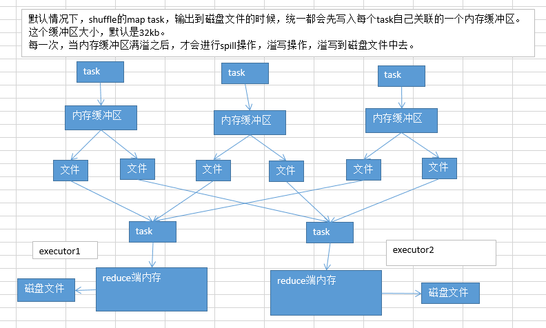

# 12.Shuffle调优之调节map端内存缓冲与reduce端内存占比

#### 参数：
```sehll
spark.shuffle.file.buffer，默认32k   #map端输出缓冲区大小
spark.shuffle.memoryFraction，0.2   #reduce拉取合并给与的内存
```
这里注意区分：storage是留给cache、persist
```shell
// 表示60%内存留给cache、persist，40%留给程序运行时对象存放使用
// 根据实际程序是否需要那么多cache来设置。
spark.storage.memoryFraction=0.6
```

map端内存缓冲，reduce端内存占比；很多资料、网上视频，都会说，这两个参数，是调节shuffle性能的不二选择，很有效果的样子，实际上，不是这样的。

以实际的生产经验来说，这两个参数没有那么重要，往往来说，shuffle的性能不是因为这方面的原因导致的

但是，有一点点效果的，broadcast，数据本地化等待时长；这两个shuffle调优的小点，其实也是需要跟其他的大量的小点配合起来使用，一点一点的提升性能，最终很多个性能调优的小点的效果，汇集在一起之后，那么就会有可以看见的还算不错的性能调优的效果。



#### reduce接收数据操作：

reduce端task，在拉取到数据之后，会用hashmap的数据格式，来对各个key对应的values进行汇聚。

针对每个key对应的values，执行我们自定义的聚合函数的代码，比如_ + _（把所有values累加起来）

reduce task，在进行汇聚、聚合等操作的时候，实际上，使用的就是自己对应的executor的内存，executor（jvm进程，堆），默认executor内存中划分给reduce task进行聚合的比例，是0.2。

问题来了，因为比例是0.2，所以，理论上，很有可能会出现，拉取过来的数据很多，那么在内存中，放不下；这个时候，默认的行为，就是说，将在内存放不下的数据，都spill（溢写）到磁盘文件中去。

#### 默认情况下，不调优，可能会出现什么样的问题？

默认，map端内存缓冲是每个task，32kb。
默认，reduce端聚合内存比例，是0.2，也就是20%。

如果map端的task，处理的数据量比较大，但是呢，你的内存缓冲大小是固定的。可能会出现什么样的情况？

每个task就处理320kb，32kb，总共会向磁盘溢写320 / 32 = 10次。
每个task处理32000kb，32kb，总共会向磁盘溢写32000 / 32 = 1000次。

在map task处理的数据量比较大的情况下，而你的task的内存缓冲默认是比较小的，32kb。可能会造成多次的map端往磁盘文件的spill溢写操作，发生大量的磁盘IO，从而降低性能。

reduce端聚合内存，占比。默认是0.2。如果数据量比较大，reduce task拉取过来的数据很多，那么就会频繁发生reduce端聚合内存不够用，频繁发生spill操作，溢写到磁盘上去。而且最要命的是，磁盘上溢写的数据量越大，后面在进行聚合操作的时候，很可能会多次读取磁盘中的数据，进行聚合。

默认不调优，在数据量比较大的情况下，可能频繁地发生reduce端的磁盘文件的读写。

这两个点之所以放在一起讲，是因为他们俩是有关联的。数据量变大，map端肯定会出点问题；reduce端肯定也会出点问题；出的问题是一样的，都是磁盘IO频繁，变多，影响性能。

#### 调优：

调节map task内存缓冲：spark.shuffle.file.buffer，默认32k（spark 1.3.x不是这个参数，后面还有一个后缀，kb；spark 1.5.x以后，变了，就是现在这个参数）
调节reduce端聚合内存占比：spark.shuffle.memoryFraction，0.2

在实际生产环境中，我们在什么时候来调节两个参数？

看Spark UI，如果你的公司是决定采用standalone模式，那么简单，你的spark跑起来，会显示一个Spark UI的地址，4040的端口，进去看，依次点击进去，可以看到，你的每个stage的详情，有哪些executor，有哪些task，每个task的shuffle write和shuffle read的量，shuffle的磁盘和内存，读写的数据量；如果是用的yarn模式来提交，课程最前面，从yarn的界面进去，点击对应的application，进入Spark UI，查看详情。

如果发现shuffle 磁盘的write和read，很大。这个时候，就意味着最好调节一些shuffle的参数。进行调优。首先当然是考虑开启map端输出文件合并机制。

调节上面说的那两个参数。调节的时候的原则。spark.shuffle.file.buffer，每次扩大一倍，然后看看效果，64，128；spark.shuffle.memoryFraction，每次提高0.1，看看效果。

不能调节的太大，太大了以后过犹不及，因为内存资源是有限的，你这里调节的太大了，其他环节的内存使用就会有问题了。

调节了以后，效果？map task内存缓冲变大了，减少spill到磁盘文件的次数；reduce端聚合内存变大了，减少spill到磁盘的次数，而且减少了后面聚合读取磁盘文件的数量。

