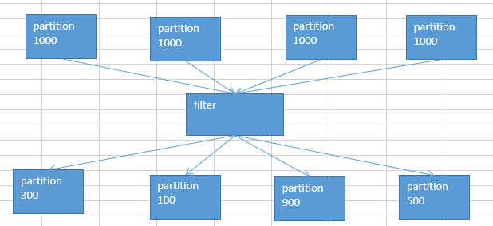

# 15.算子调优之filter过后使用coalesce减少分区数量

通过filter后的partition会发生改变，导致数量也不不一样。

默认情况下，经过了这种filter之后，RDD中的每个partition的数据量，可能都不太一样了。（原本每个partition的数据量可能是差不多的）

#### 问题：

1. 每个partition数据量变少了，但是在后面进行处理的时候，还是要跟partition数量一样数量的task，来进行处理；有点浪费task计算资源。

2. 每个partition的数据量不一样，会导致后面的每个task处理每个partition的时候，每个task要处理的数据量就不同，这个时候很容易发生什么问题？数据倾斜。

比如说，第二个partition的数据量才100；但是第三个partition的数据量是900；那么在后面的task处理逻辑一样的情况下，不同的task要处理的数据量可能差别达到了9倍，甚至10倍以上；同样也就导致了速度的差别在9倍，甚至10倍以上。

这样的话呢，就会导致有些task运行的速度很快；有些task运行的速度很慢。这，就是数据倾斜。

#### 解决办法：

针对上述的两个问题，我们希望应该能够怎么样？

1. 针对第一个问题，我们希望可以进行partition的压缩吧，因为数据量变少了，那么partition其实也完全可以对应的变少。比如原来是4个partition，现在完全可以变成2个partition。那么就只要用后面的2个task来处理即可。就不会造成task计算资源的浪费。（不必要，针对只有一点点数据的partition，还去启动一个task来计算）

2. 针对第二个问题，其实解决方案跟第一个问题是一样的；也是去压缩partition，尽量让每个partition的数据量差不多。那么这样的话，后面的task分配到的partition的数据量也就差不多。不会造成有的task运行速度特别慢，有的task运行速度特别快。避免了数据倾斜的问题。

有了解决问题的思路之后，接下来，我们该怎么来做呢？实现？

**coalesce算子**

> 该算子，主要就是用于在filter操作之后，针对每个partition的数据量各不相同的情况，来压缩partition的数量。减少partition的数量，而且让每个partition的数据量都尽量均匀紧凑。

从而便于后面的task进行计算操作，在某种程度上，能够一定程度的提升性能。