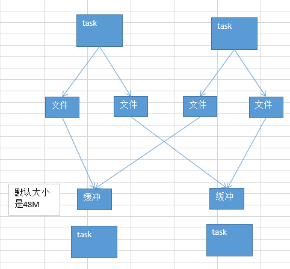

# 19.troubleshooting之控制shuffle reduce端缓冲大小以避免OOM

#### 使用
```shell
spark.reducer.maxSizeInFlight，48
```



map端的task是不断的输出数据的，数据量可能是很大的。  

但是，其实reduce端的task，并不是等到map端task将属于自己的那份数据全部写入磁盘文件之后，再去拉取的。map端写一点数据，reduce端task就会拉取一小部分数据，立即进行后面的聚合、算子函数的应用。  

每次reduece能够拉取多少数据，就由buffer来决定。因为拉取过来的数据，都是先放在buffer中的。然后才用后面的executor分配的堆内存占比（0.2），hashmap，去进行后续的聚合、函数的执行。  
#### reduce端缓冲（buffer），可能会出什么问题？

可能是会出现，默认是48MB，也许大多数时候，reduce端task一边拉取一边计算，不一定一直都会拉满48M的数据。可能大多数时候，拉取个10M数据，就计算掉了。  
大多数时候，也许不会出现什么问题。但是有的时候，map端的数据量特别大，然后写出的速度特别快。reduce端所有task，拉取的时候，全部达到自己的缓冲的最大极限值，缓冲，48M，全部填满。  

这个时候，再加上你的reduce端执行的聚合函数的代码，可能会创建大量的对象。也许，一下子，内存就撑不住了，就会OOM。reduce端的内存中，就会发生内存溢出的问题。  

#### 针对上述的可能出现的问题，我们该怎么来解决呢？

这个时候，就应该减少reduce端task缓冲的大小。宁愿多拉取几次，但是每次同时能够拉取到reduce端每个task的数量，比较少，就不容易发生OOM内存溢出的问题。（比如，可以调节成12M）  

在实际生产环境中，我们都是碰到过这种问题的。这是典型的以性能换执行的原理。reduce端缓冲小了，不容易OOM了，但是，性能一定是有所下降的，你要拉取的次数就多了。就走更多的网络传输开销。  

这种时候，只能采取牺牲性能的方式了，spark作业，首先，第一要义，就是一定要让它可以跑起来。分享一个经验，曾经写过一个特别复杂的spark作业，写完代码以后，半个月之内，就是跑不起来，里面各种各样的问题，需要进行troubleshooting。调节了十几个参数，其中就包括这个reduce端缓冲的大小。总算作业可以跑起来了。  

然后才去考虑性能的调优。

#### 再来说说，reduce端缓冲大小的另外一面，关于性能调优的一面：

假如说，Map端输出的数据量也不是特别大，然后整个application的资源也特别充足。200个executor、5个cpu core、10G内存。

其实可以尝试去增加这个reduce端缓冲大小的，比如从48M，变成96M。那么这样的话，每次reduce task能够拉取的数据量就很大。需要拉取的次数也就变少了。比如原先需要拉取100次，现在只要拉取50次就可以执行完了。

对网络传输性能开销的减少，以及reduce端聚合操作执行的次数的减少，都是有帮助的。

最终达到的效果，就应该是性能上的一定程度上的提升。

一定要注意，资源足够的时候，再去做这个事儿。
