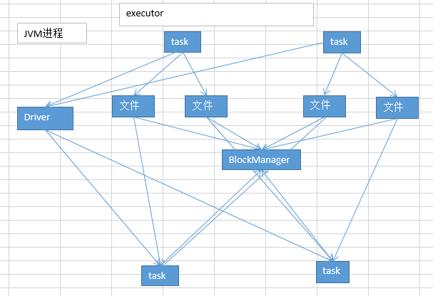

# 20.troubleshooting之解决JVM GC导致的shuffle文件拉取失败

#### 使用
```shell
# 第一个参数，意思就是说，shuffle文件拉取的时候，如果没有拉取到（拉取失败），最多或重试几次（会重新拉取几次文件），默认是3次。
spark.shuffle.io.maxRetries 3

# 第二个参数，意思就是说，每一次重试拉取文件的时间间隔，默认是5s钟。
spark.shuffle.io.retryWait 5s
```
默认情况下，假如说第一个stage的executor正在进行漫长的full gc。第二个stage的executor尝试去拉取文件，结果没有拉取到，默认情况下，会反复重试拉取3次，每次间隔是五秒钟。最多只会等待3 * 5s = 15s。如果15s内，没有拉取到shuffle file。就会报出shuffle file not found。  

针对这种情况，我们完全可以进行预备性的参数调节。增大上述两个参数的值，达到比较大的一个值，尽量保证第二个stage的task，一定能够拉取到上一个stage的输出文件。避免报shuffle file not found。然后可能会重新提交stage和task去执行。那样反而对性能也不好。  

spark.shuffle.io.maxRetries 60  
spark.shuffle.io.retryWait 60s

最多可以忍受1个小时没有拉取到shuffle file。只是去设置一个最大的可能的值。full gc不可能1个小时都没结束.  

这样呢，就可以尽量避免因为gc导致的shuffle file not found，无法拉取到的问题。

#### 原理



####　现象  
有时会出现的一种情况，非常普遍，在spark的作业中；shuffle file not found。（spark作业中，非常非常常见的）而且，有的时候，它是偶尔才会出现的一种情况。有的时候，出现这种情况以后，会重新去提交stage、task。重新执行一遍，发现就好了。没有这种错误了。  

log怎么看？用client模式去提交你的spark作业。比如standalone client；yarn client。一提交作业，直接可以在本地看到刷刷刷更新的log。

#### 原因  
比如，executor的JVM进程，可能内存不是很够用了。那么此时可能就会执行GC。minor GC or full GC。总之一旦发生了JVM之后，就会导致executor内，所有的工作线程全部停止，比如BlockManager，基于netty的网络通信。  

下一个stage的executor，可能是还没有停止掉的，task想要去上一个stage的task所在的exeuctor，去拉取属于自己的数据，结果由于对方正在gc，就导致拉取了半天没有拉取到。  

就很可能会报出，shuffle file not found。但是，可能下一个stage又重新提交了stage或task以后，再执行就没有问题了，因为可能第二次就没有碰到JVM在gc了。