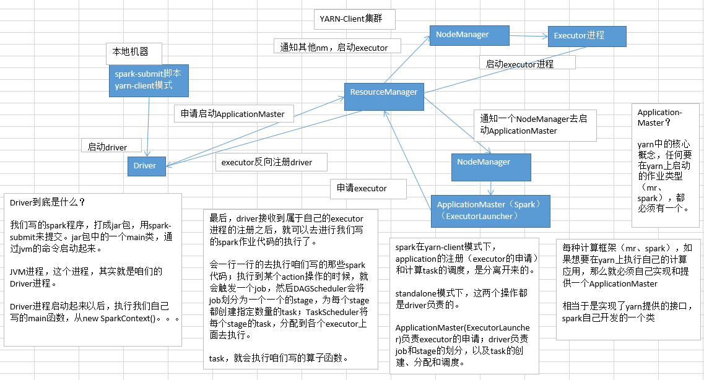

# 24.troubleshooting之解决yarn-client模式导致的网卡流量激增问题

#### yarn-client模式

#### yarn-client模式下，会产生什么样的问题呢？

由于咱们的driver是启动在本地机器的，而且driver是全权负责所有的任务的调度的，也就是说要跟yarn集群上运行的多个executor进行频繁的通信（中间有task的启动消息、task的执行统计消息、task的运行状态、shuffle的输出结果）。

咱们来想象一下。比如你的executor有100个，stage有10个，task有1000个。每个stage运行的时候，都有1000个task提交到executor上面去运行，平均每个executor有10个task。接下来问题来了，driver要频繁地跟executor上运行的1000个task进行通信。通信消息特别多，通信的频率特别高。运行完一个stage，接着运行下一个stage，又是频繁的通信。

在整个spark运行的生命周期内，都会频繁的去进行通信和调度。所有这一切通信和调度都是从你的本地机器上发出去的，和接收到的。这是最要人命的地方。你的本地机器，很可能在30分钟内（spark作业运行的周期内），进行频繁大量的网络通信。那么此时，你的本地机器的网络通信负载是非常非常高的。会导致你的本地机器的网卡流量会激增！！！

你的本地机器的网卡流量激增，当然不是一件好事了。因为在一些大的公司里面，对每台机器的使用情况，都是有监控的。不会允许单个机器出现耗费大量网络带宽等等这种资源的情况。运维人员。可能对公司的网络，或者其他（你的机器还是一台虚拟机），对其他机器，都会有负面和恶劣的影响。

#### 解决的方法：

实际上解决的方法很简单，就是心里要清楚，yarn-client模式是什么情况下，可以使用的？yarn-client模式，通常咱们就只会使用在测试环境中，你写好了某个spark作业，打了一个jar包，在某台测试机器上，用yarn-client模式去提交一下。因为测试的行为是偶尔为之的，不会长时间连续提交大量的spark作业去测试。还有一点好处，yarn-client模式提交，可以在本地机器观察到详细全面的log。通过查看log，可以去解决线上报错的故障（troubleshooting）、对性能进行观察并进行性能调优。

实际上线了以后，在生产环境中，都得用yarn-cluster模式，去提交你的spark作业。

yarn-cluster模式，就跟你的本地机器引起的网卡流量激增的问题，就没有关系了。也就是说，就算有问题，也应该是yarn运维团队和基础运维团队之间的事情了。使用了yarn-cluster模式以后，就不是你的本地机器运行Driver，进行task调度了。是yarn集群中，某个节点会运行driver进程，负责task调度。
