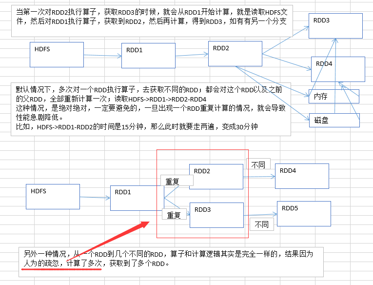

# 3.性能调优之在实际项目中重构RDD架构以及RDD持久化

重复计算场景：（对RDD2进行持久化，放内存和磁盘。后面的RDD3和RDD4就会直接到内存和磁盘读取）

**优化：**

1. RDD架构重构与优化

尽量复用RDD，可以抽取称为一个共同的RDD，供后面的RDD计算时，反复使用。

2. 公共RDD一定要实现持久化

对于要多次计算和使用的公共RDD，一定要进行持久化。

持久化，也就是说，将RDD的数据缓存到内存中/磁盘中，（BlockManager），以后无论对这个RDD做多少次计算，那么都是直接取这个RDD的持久化的数据，比如从内存中或者磁盘中，直接提取一份数据。

3. 持久化，是可以进行序列化的

如果正常将数据持久化在内存中，那么可能会导致内存的占用过大，这样的话，也许，会导致OOM内存溢出。

当纯内存无法支撑公共RDD数据完全存放的时候，就优先考虑，使用序列化的方式在纯内存中存储。将RDD的每个partition的数据，序列化成一个大的字节数组，就一个对象；序列化后，大大减少内存的空间占用。

序列化的方式，唯一的缺点就是，在获取数据的时候，需要反序列化。

如果序列化纯内存方式，还是导致OOM，内存溢出；就只能考虑磁盘的方式，内存+磁盘的普通方式（无序列化）。

如何还不行，只能：内存+磁盘，序列化

4.  为了数据的高可靠性，而且内存充足，可以使用双副本机制，进行持久化

持久化的双副本机制，持久化后的一个副本，因为机器宕机了，副本丢了，就还是得重新计算一次；持久化的每个数据单元，存储一份副本，放在其他节点上面；从而进行容错；一个副本丢了，不用重新计算，还可以使用另外一份副本。

这种方式，仅仅针对你的内存资源极度充足
