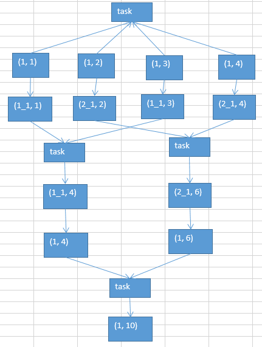

# 30.数据倾斜解决方案之使用随机key实现双重聚合

使用随机key实现双重聚合

1. 原理

2. 使用场，,比较适合使用这种方式
   （1）groupByKey
   （2）reduceByKey

> join，咱们通常不会这样来做，后面会讲三种，针对不同的join造成的数据倾斜的问题的解决方案。

第一轮聚合的时候，对key进行打散，将原先一样的key，变成不一样的key，相当于是将每个key分为多组；  
先针对多个组，进行key的局部聚合；接着，再去除掉每个key的前缀，然后对所有的key，进行全局的聚合。  
对groupByKey、reduceByKey造成的数据倾斜，有比较好的效果。  

如果说，之前的第一、第二、第三种方案，都没法解决数据倾斜的问题，那么就只能依靠这一种方式了。
