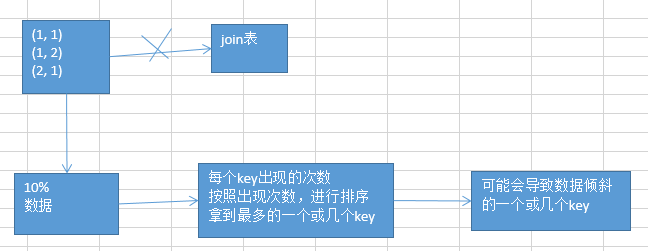
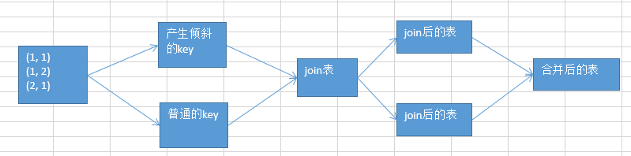

# 32.数据倾斜解决方案之sample采样倾斜key单独进行join

####思路
其中某一个RDD/Hive表中的少数几个key的数据量过大，而另一个RDD/Hive表中的所有key都分布比较均匀，那么采用这个解决方案是比较合适的。
将少数key数据量过大的RDD进行采样，对key进行排序，找出最多的key：

将RDD拆分出2个RDD，分别进行join，最后将join后的表惊醒union操作。

这个方案的实现思路，跟大家解析一下：其实关键之处在于，将发生数据倾斜的key，单独拉出来，放到一个RDD中去；就用这个原本会倾斜的key RDD跟其他RDD，单独去join一下，这个时候，key对应的数据，可能就会分散到多个task中去进行join操作。

就不至于说是，这个key跟之前其他的key混合在一个RDD中时，肯定是会导致一个key对应的所有数据，都到一个task中去，就会导致数据倾斜。

#### 这种方案什么时候适合使用？  
优先对于join，肯定是希望能够采用上一讲讲的，reduce join转换map join。两个RDD数据都比较大，那么就不要那么搞了。

针对你的RDD的数据，你可以自己把它转换成一个中间表，或者是直接用countByKey()的方式，你可以看一下这个RDD各个key对应的数据量；此时如果你发现整个RDD就一个，或者少数几个key，是对应的数据量特别多；尽量建议，比如就是一个key对应的数据量特别多。

此时可以采用咱们的这种方案，单拉出来那个最多的key；单独进行join，尽可能地将key分散到各个task上去进行join操作。

#### 什么时候不适用呢？  
如果一个RDD中，导致数据倾斜的key，特别多；那么此时，最好还是不要这样了；还是使用我们最后一个方案，终极的join数据倾斜的解决方案。

#### 最后  
就是说，咱们单拉出来了，一个或者少数几个可能会产生数据倾斜的key，然后还可以进行更加优化的一个操作；

对于那个key，从另外一个要join的表中，也过滤出来一份数据，比如可能就只有一条数据。userid2infoRDD，一个userid key，就对应一条数据。

然后呢，采取对那个只有一条数据的RDD，进行flatMap操作，打上100个随机数，作为前缀，返回100条数据。

单独拉出来的可能产生数据倾斜的RDD，给每一条数据，都打上一个100以内的随机数，作为前缀。

再去进行join，是不是性能就更好了。肯定可以将数据进行打散，去进行join。join完以后，可以执行map操作，去将之前打上的随机数，给去掉，然后再和另外一个普通RDD join以后的结果，进行union操作。
