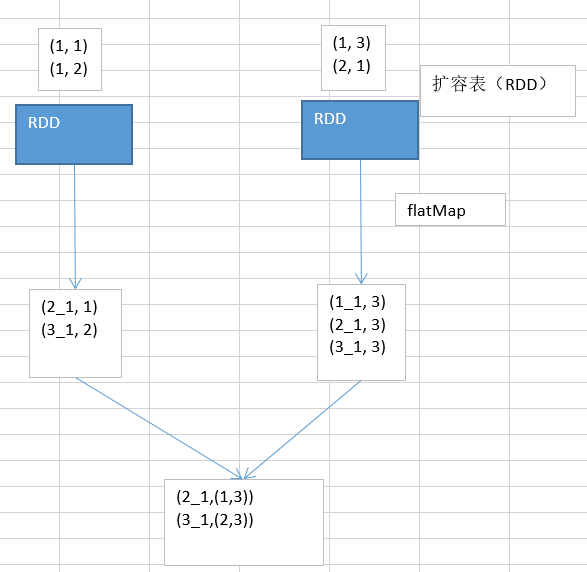

# 33.数据倾斜解决方案之使用随机数以及扩容表进行join

当采用随机数和扩容表进行join解决数据倾斜的时候，就代表着，你的之前的数据倾斜的解决方案，都没法使用。

这个方案是没办法彻底解决数据倾斜的，更多的，是一种对数据倾斜的缓解。

原理，其实在上一讲，已经带出来了。

#### 步骤：

1、选择一个RDD，要用flatMap，进行扩容，将每条数据，映射为多条数据，每个映射出来的数据，都带了一个n以内的随机数，通常来说，会选择10。

2、将另外一个RDD，做普通的map映射操作，每条数据，都打上一个10以内的随机数。

3、最后，将两个处理后的RDD，进行join操作。

#### 局限性：

1、因为你的两个RDD都很大，所以你没有办法去将某一个RDD扩的特别大，一般咱们就是10倍。

2、如果就是10倍的话，那么数据倾斜问题，的确是只能说是缓解和减轻，不能说彻底解决。

#### sample采样倾斜key并单独进行join

将key，从另外一个RDD中过滤出的数据，可能只有一条，或者几条，此时，咱们可以任意进行扩容，扩成1000倍。

将从第一个RDD中拆分出来的那个倾斜key RDD，打上1000以内的一个随机数。

这种情况下，还可以配合上，提升shuffle reduce并行度，join(rdd, 1000)。通常情况下，效果还是非常不错的。

打散成100份，甚至1000份，2000份，去进行join，那么就肯定没有数据倾斜的问题了吧。
